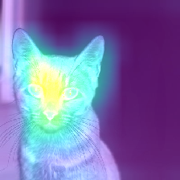

autoscale: true
slidenumbers: false
slidecount: false
list: alignment(left)
slide-transition: true

# [fit] **EVERYTHING IS**

# [fit] `XAI`

---

# [fit] THIS PRESENTATION IS ABOUT

- a recap of this week
- model (un)certainty
- gradCAMs
- the Nigerian prince.

---

# [fit] TAXONOMY


- **by default**
    1. linear models
    2. tree-based models

- **XAI**
  - global vs local methods
  - model-specific vs model-agnostic

> classify gradCAM according to the taxonomy

---

# [fit] MODEL (UN)CERTAINTY


> “It is remarkable that science, which originated in the consideration of games of chance, should have become the most important object of human knowledge.”
-- Pierre Simon Laplace

---

# [fit] MODEL (UN)CERTAINTY I


## **aleatoric uncertainty**

statistical in nature, refers to random variation

:bell: $$ P(Y|X;\theta)$$

### more data is not a solution

> data quality, model averaging, and prediction intervals help.

---

# [fit] MODEL (UN)CERTAINTY II


## **epistemic uncertainty**

human in nature, refers to ignorance  

:bell: $$ P(Y|X;\theta)$$

### more data is a solution

> hyperparameter tuning, regularization etc. help

---

[.build-lists: true]

# [fit] HOW IS THIS USEFUL?


If we train a classifier on digits [0,8], what happens when we run..?

- model.predict([2])
- model.predict([7])
- model.predict([9])

:exclamation: Never forget that the models you build are probabilistic in nature

---

# [fit] :taxi:

## `May occasionally kill passengers`

---

# [fit] :musical_note: MIND YOUR STEP


:warning: **neural networks tend to be overconfident when being completely wrong**

think self-driving cars, medical diagnosis,
[or exploding rockets](https://www.youtube.com/watch?v=bvim4rsNHkQ)

## :raising_hand: XAI

---

# EXPLAINING NEURAL NETWORKS

---

# GradCAM

:bell: gradCAM is a technique for visualizing the activations of a **CNN layer** by producing a heatmap that highlights the regions of an **input image** that are most relevant **to a particular output class.**


- helps to understand how a CNN works
- can be used to debug a CNN
- **can be used to create visual explanations for the predictions made by a CNN**

---

# HOW DOES GRADCAM WORK?


gradCAM works by computing the gradients of the output class score with respect to the feature maps of the last convolutional layer in the CNN. These gradients are then used to compute a weight map for each feature map, which are then multiplied together and summed to produce the final heatmap [^1].

[^1]: Molnar, C. (2020). Interpretable machine learning. Lulu. com. [website](https://christophm.github.io/interpretable-ml-book/).

---

# TF_EXPLAIN

[.column]
[.code-highlight: all]

```python

!pip install tf_explain
!pip install opencv-python

#load libraries
import numpy as np
import tensorflow as tf
import PIL

#load GradCAM
from tf_explain.core.grad_cam import GradCAM

IMAGE_PATH = "./assets/images/cat.jpg" 
class_index = 281

img = tf.keras.preprocessing.image.load_img(IMAGE_PATH, target_size=(224, 224))
img = tf.keras.preprocessing.image.img_to_array(img)

model = tf.keras.applications.vgg16.VGG16(weights="imagenet", include_top=True)

#get model summary
model.summary()

#first create the input in a format that the explainer expects (a tuple)
input_img = (np.array([img]), None)

#initialize the explainer as an instance of the GradCAM object
explainer = GradCAM()

# Obtain explanations for your image using VGG 16 and GradCAM
grid = explainer.explain(input_img,
                         model,
                         class_index=class_index
                         )

#save the resulting image
explainer.save(grid, "./outputs/explain/", "grad_cam_cat.png")
```

[.column]


---

# TF_EXPLAIN

[.column]
[.code-highlight: 1, 8-10, 26-35]

```python

!pip install tf_explain
!pip install opencv-python

#load libraries
import numpy as np
import tensorflow as tf
import PIL

#load GradCAM
from tf_explain.core.grad_cam import GradCAM

IMAGE_PATH = "./assets/images/cat.jpg" 
class_index = 281

img = tf.keras.preprocessing.image.load_img(IMAGE_PATH, target_size=(224, 224))
img = tf.keras.preprocessing.image.img_to_array(img)

model = tf.keras.applications.vgg16.VGG16(weights="imagenet", include_top=True)

#get model summary
model.summary()

#first create the input in a format that the explainer expects (a tuple)
input_img = (np.array([img]), None)

#initialize the explainer as an instance of the GradCAM object
explainer = GradCAM()

# Obtain explanations for your image using VGG 16 and GradCAM
grid = explainer.explain(input_img,
                         model,
                         class_index=class_index
                         )

#save the resulting image
explainer.save(grid, "./outputs/explain/", "grad_cam_cat.png")
```

[.column]



---

# SOURCE CODE


:computer: [https://github.com/sicara/tf-explain](https://github.com/sicara/tf-explain)

- [x] gradCAM
- [x] smoothGrad
- [x] guided smoothgrad
- [x] integrated gradients
- [x] occlusion sensitivity
- [x] activations visualization

**this is an active area of research, so expect more methods to be added in the future**

---

# [fit] THE NIGERIAN PRINCE


---

# [fit] MOVING BEYOND FEATURE ATTRIBUTION


- deep neural networks are notoriously sensitive to small perturbations in the input
- by intentionally introducing small perturbations in the input, we can fool the model into making a different prediction
- the nigerian prince scam is a classic example of this, where the scammer intentionally introduces small perturbations in the email to fool the spam filter into predicting that the email is not spam

---

# [fit] ADVERSARIAL TRAINING vs ADVERSARIAL ATTACKS 

[.column]
:white_circle:

- Using **complete knowledge** of the model architecture, it's sources of uncertainty, it's parameters, and the training data, we can intentionally introduce adversarial examples to the model to test the robustness and reliability of the model. **adversarial training**. Used to improve the network's ability to make accurate predictions in real-world scenarios.

- An example of adversarial training is training a neural network to recognize handwritten digits by incorporating adversarial examples of slightly modified digits to the training data. 

[.column]
:black_circle:

- Using **incomplete knowledge** of the model architecture, it's sources of uncertainty, it's parameters, and the training data, we can intentionally try to manipulate the input data to cause it to make incorrect predictions. **adversarial attacks**. Used to identify vulnerabilities in the network and to improve security.

- An example of an adversarial attack is adding a small amount of noise to an image of a stop sign in order to make it appear as a yield sign to an autonomous vehicle's image recognition system.

---

# [fit] ADVERSARIAL ATTACKS


---

# [fit] SUMMARY :notebook_with_decorative_cover:

- **XAI** is a field of research that aims to make machine learning models more interpretable and explainable
- **linear models** are intrinsically interpretable because they are linear functions of the input features
- **decision trees** are intrinsically interpretable because they are a series of if-then-else statements
- **neural networks** are not intrinsically interpretable because they are non-linear functions of the input features. They need to be **interpreted** for high-stakes decision making applications.
- **quantifying uncertainty** is a key component of XAI regardless of the model architecture
- **gradCAM** is a technique for visualizing the activations of a CNN layer by producing a heatmap that highlights the regions of an input image that are most relevant to a particular output class
- **tf_explain** is one among several python library that makes it easy to use XAI techniques in your machine learning projects
- **adversarial attacks** and **adversarial training** are two different approaches to testing the reliability and robustness of machine learning models

---

# [fit] YOU CAN CHOOSE TO GO DEEPER IN A TOPIC OF YOUR CHOICE

## **THANK YOU!**

[.footer: [@nbhushan](https://github.com/nbhushan)]
